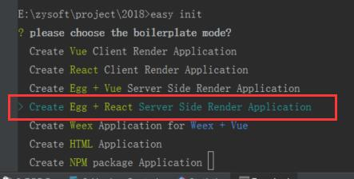
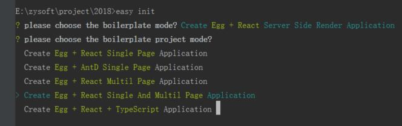
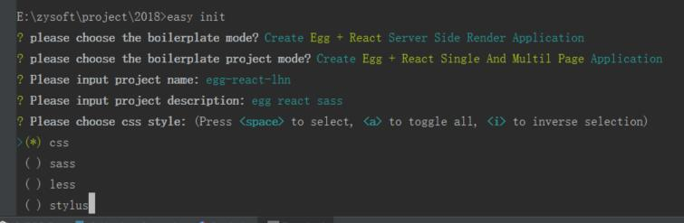
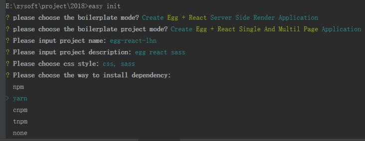

# webpack 构建例子
- [eggjs+react](#eggjs+react) 通过easywebpack-cli脚手架来构建egg react项目 引入sass

## eggjs+react
1. 安装脚手架 然后就可以使用 easywebpack 或 easy 命令
```bash
npm install easywebpack-cli -g
```
2.命令行运行,进入目录，进行项目初始化设置，进行上下选择
```bash
easywebpack init
```





- [egg-react-webpack-boilerplate](https://github.com/easy-team/egg-react-webpack-boilerplate) 相关说明

